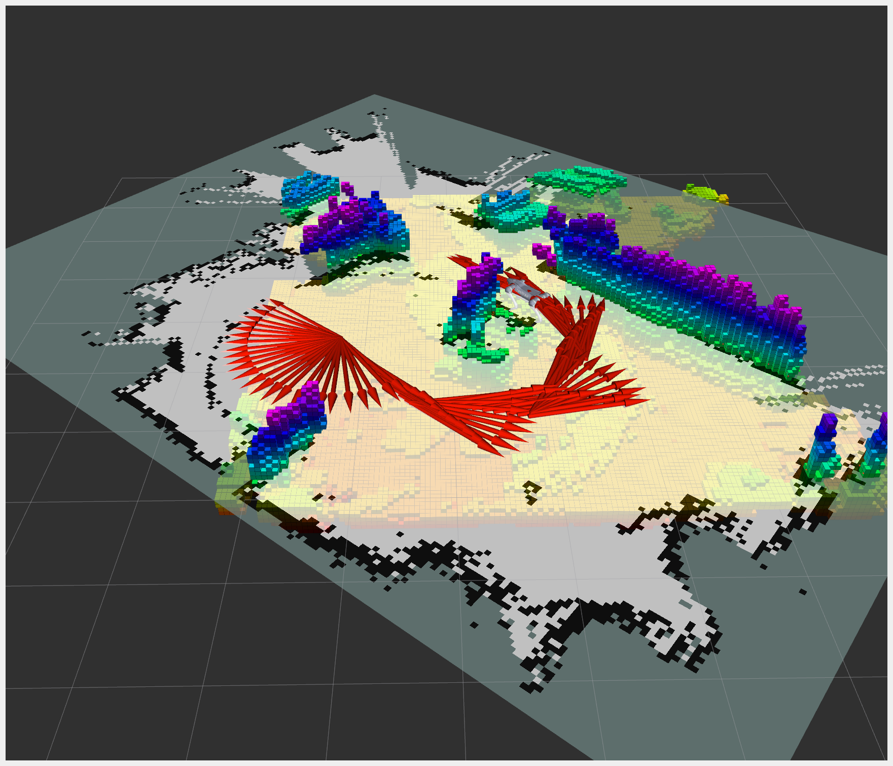
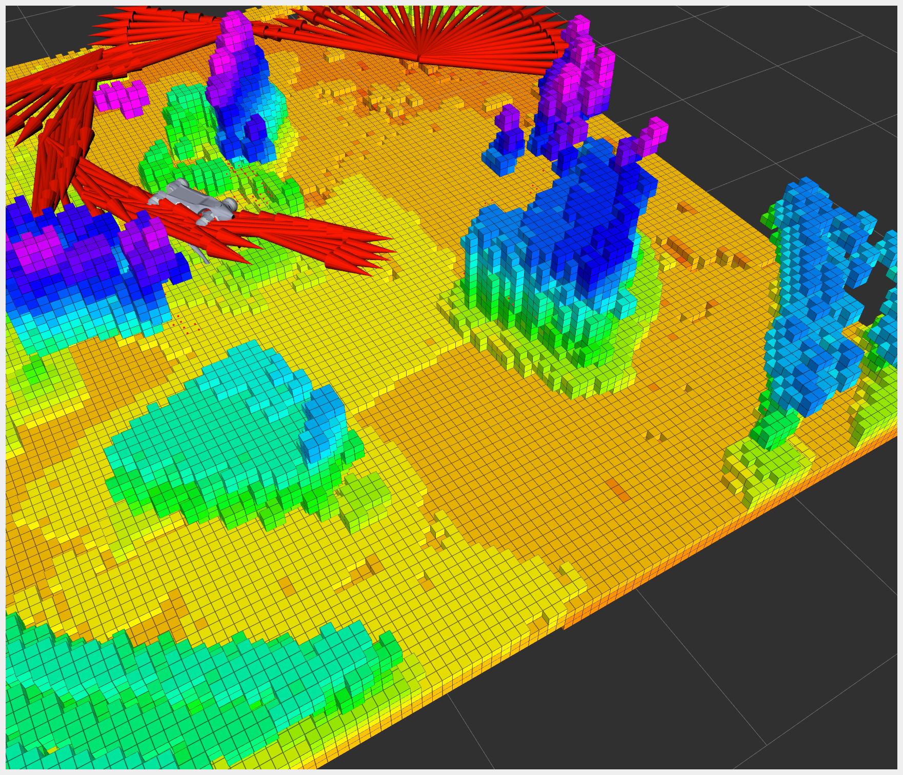

# Welcome to the Unitree Go2 ROS2 SDK Project!

[](https://docs.omniverse.nvidia.com/isaacsim/latest/overview.html)
[](https://docs.python.org/3/whatsnew/3.10.html)
[](https://releases.ubuntu.com/22.04/)
[](https://www.microsoft.com/en-us/)

[](https://opensource.org/licenses/BSD-2-Clause)


We are happy to present you our integration of the Unitree Go2 with ROS2 over Wi-Fi, that was designed by the talented [@tfoldi](https://github.com/tfoldi). You can explore his groundbreaking work at [go2-webrtc](https://github.com/tfoldi/go2-webrtc).

This repo will empower your Unitree GO2 AIR/PRO/EDU robots with ROS2 capabilities, using both WebRTC (Wi-Fi) and CycloneDDS (Ethernet) protocols.

If you are using WebRTC (Wi-Fi) protocol, close the connection with a mobile app before connecting to the robot.

## Project RoadMap:

1. URDF :white_check_mark: 
2. Joint states sync in real time :white_check_mark: 
3. IMU sync in real time :white_check_mark: 
4. Joystick control in real time :white_check_mark: 
6. Go2 topics info in real time :white_check_mark: 
7. Foot force sensors info in real time :white_check_mark: 
8. Lidar stream (added pointCloud2) :white_check_mark: 
9. Camera stream :white_check_mark:
10. Foxglove bridge :white_check_mark:
11. Laser Scan :white_check_mark:
12. Multi robot support :white_check_mark:
13. WebRTC and CycloneDDS support :white_check_mark:
14. Creating a PointCloud map and store it :white_check_mark:
15. SLAM (slam_toolbox) :white_check_mark:
16. Navigation (nav2) :white_check_mark:
17. Object detection
18. AutoPilot

## Your feedback and support mean the world to us. 

If you're as enthusiastic about this project as we are, please consider giving it a :star: star!!!

Your encouragement fuels our passion and helps us develop our RoadMap further. We welcome any help or suggestions you can offer!

Together, let's push the boundaries of what's possible with the Unitree Go2 and ROS2!

## Exciting Features:

:sparkles: Full ROS2 SDK support for your Unitree GO2

:robot: Compatible with AIR, PRO, and EDU variants

:footprints: Access to foot force sensors feedback (available on some GO2 PRO models or EDU)


## Real time Go2 Air/PRO/EDU joints sync:

<p align="center">

</p>

## Go2 Air/PRO/EDU lidar point cloud:

<p align="center">

</p>


## System requirements

Tested systems and ROS2 distro
|systems|ROS2 distro|Build status
|--|--|--|
|Ubuntu 22.04|iron|
|Ubuntu 22.04|humble|
|Ubuntu 22.04|rolling|

## Installation

```shell
mkdir -p ros2_ws
cd ros2_ws
git clone --recurse-submodules https://github.com/abizovnuralem/go2_ros2_sdk.git src
sudo apt install ros-$ROS_DISTRO-image-tools
sudo apt install ros-$ROS_DISTRO-vision-msgs

sudo apt install python3-pip clang portaudio19-dev
cd src
pip install -r requirements.txt
cd ..
```
Pay attention to any error messages. If `pip install` does not complete cleanly, various features will not work. For example, `open3d` does not yet support `python3.12` and therefore you will need to set up a 3.11 `venv` first etc.

Install `rust` language support following these [instructions](https://www.rust-lang.org/tools/install). Then, install version 1.79 of `cargo`, the `rust` package manager.
```shell
rustup install 1.79.0
rustup default 1.79.0
```

`cargo` should now be available in the terminal:
```shell
cargo --version
```

Build `go2_ros_sdk`. You need to have `ros2` and `rosdep` installed. If you do not, follow these [instructions](https://docs.ros.org/en/humble/Installation.html). Then:
```shell
source /opt/ros/$ROS_DISTRO/setup.bash
rosdep install --from-paths src --ignore-src -r -y
colcon build
```

## Usage

Don't forget to set up your Go2 robot in Wifi-mode and obtain the IP. You can use the mobile app to get it. Go to Device -> Data -> Automatic Machine Inspection and look for STA Network: wlan0.

```shell
source install/setup.bash
export ROBOT_IP="robot_ip" #for muliple robots, just split by ,
export CONN_TYPE="webrtc"
ros2 launch go2_robot_sdk robot.launch.py
```

The `robot.launch.py` code starts many services/nodes simultaneously, including 

* robot_state_publisher
* ros2_go2_video (front color camera)
* pointcloud_to_laserscan_node
* go2_robot_sdk/go2_driver_node
* go2_robot_sdk/lidar_to_pointcloud
* rviz2
* `joy` (ROS2 Driver for Generic Joysticks and Game Controllers)
* `teleop_twist_joy` (facility for tele-operating Twist-based ROS2 robots with a standard joystick. Converts joy messages to velocity commands)       
* `twist_mux` (twist_multiplexer with source prioritization)        
* foxglove_launch (launches the foxglove bridge)
* slam_toolbox/online_async_launch.py
* av2_bringup/navigation_launch.py

When you run `robot.launch.py`, `rviz` will fire up, lidar data will begin to accumulate, the front color camera data will be displayed too (typically after 4 seconds), and your dog will be waiting for commands from your joystick (e.g. a X-box controller). You can then steer the dog through your house, e.g., and collect LIDAR mapping data. 

### SLAM and Nav2



The goal of SLAM overall, and the `slam_toolbox` in particular, is to create a map. The `slam_toolbox` is a grid mapper - it thinks about the world in terms of a fixed grid that the dog operates in. When the dog initially moves through a new space, data accumulate and the developing map is and published it to the `/map` topic. The goal of `Nav2` is to navigate and perform other tasks in this map.

The `rviz` settings that are used upon initial launch (triggered by `ros2 launch go2_robot_sdk robot.launch.py`) showcase various datastreams.  

* `RobotModel` is the dimensionally correct model of the G02 
* `PointCloud2` are the raw LIDAR data transformed into 3D objects/constraints 
* `LaserScan` are lower level scan data before translation into an x,y,z frame
* `Image` are the data from the front-facing color camera 
* `Map` is the map being created by the `slam_toolbox`
* `Odometry` is the history of directions/movements of the dog

If there is too much going on in the initial screen, deselect the `map` topic to allow you to see more.



### Mapping - creating your first map

Use painter's tape to mark a 'dock' rectangle (or use a real dock) to create a defined starting point for your dog on your floor. In the `rviz` `SlamToolboxPlugin`, on the left side of the your `rviz` screen, select "Start At Dock". Then, use your controller to manually explore a space, such as a series of rooms. You will see the map data accumulating in `rviz`. In this map, white, black and grey pixels represent the free, occupied, and unknown space, respectively. When you are done mapping, enter a file name into the "Save Map" field and click "Save Map". Then enter a file name into "Serialize Map" field and click "Serialize Map". Now, you should have 2 new files in `/ros2_ws`:

```shell
map_1.yaml: the metadata for the map as well as the path to the .pgm image file.
map_1.pgm: the image file with white, black and grey pixels representing the free, occupied, and unknown space.
map_1.data: 
map_1.posegraph: 
```

The next time you start the system, the map can be loaded and is ready for you to complete/extend by mapping more spaces. Upon restart and loading a map, the dog does not know where it is relative to the map you created earlier. Assuming you rebooted the dog in its marked rectangle, or in an actual dock, it will have a high quality initial position and angle.  

### Autonomous Navigation - navigating in your new map

As shown in the `rviz` `Navigation 2` plugin, the system will come up in:

```shell
Navigation: active
Localization: inactive
Feedback: unknown
```

Then, load your map via the `SlamToolboxPlugin` (enter your map's filename (without any extension) in the 'Deserialize Map' field and then click 'Deserialize Map'). 

**WARNING**: please make sure that (1) the dog is correctly oriented WRT to the map and (2) the map itself is sane and corresponds to your house. Especially if you have long corridors, the overall map can be distorted relative to reality, and this means that the route planner will try to route your dog through walls, leaving long scratches in your walls. 

You can now give the dog its first target, via 'Nav2 Goal' in the `rviz` menu. Use the mouse cursor to provide a target to navigate to.

**NOTE**: the `Nav2 Goal` cursor sets both the target position and the final angle of the dog, that you wish the dog to adopt upon reaching the target (need to double check). The long green arrow that is revealed when you click an point and keep moving your mouse cursor is the angle setter. 

Until you have some experience, we suggest following your dog and picking it up when it is about to do something silly.

**NOTE**: Virtually all fault behaviors - spinning in circles, running into walls, trying to walk through walls, etc reflect (1) a map that is incorrect, (2) incorrect initial position/angle of the dog relative to that map, or (3) inability to compute solutions/paths based on overloaded control loops. To prevent #3, which results in no motion or continuous spinning, the key loop rates (`controller_frequency`: 3.0 and `expected_planner_frequency`: 1.0 have been set to very conservative rates). 

## Real time image detection and tracking

This capability is directly based on [J. Francis's work](https://github.com/jfrancis71/ros2_coco_detector). Launch the `go2_ro2_sdk`. After a few seconds, the color image data will be available at `go2_camera/color/image`. On another terminal enter:

```bash
source install/setup.bash
ros2 run coco_detector coco_detector_node
```

There will be a short delay the first time the node is run for PyTorch TorchVision to download the neural network. You should see a download progress bar. TorchVision cached for subsequent runs.

On another terminal, to view the detection messages:
```shell
source install/setup.bash
ros2 topic echo /detected_objects
```
The detection messages contain the detected object (`class_id`) and the `score`, a number from 0 to 1. For example: `detections:results:hypothesis:class_id: giraffe` and `detections:results:hypothesis:score: 0.9989`. The `bbox:center:x` and `bbox:center:y` contain the centroid of the object in pixels. These data can be used to implement real-time object following for animals and people. People are detected as `detections:results:hypothesis:class_id: person`.

To view the image stream annotated with the labels and bounding boxes:
```shell
source install/setup.bash
ros2 run image_tools showimage --ros-args -r /image:=/annotated_image
```

Example Use:
```shell
ros2 run coco_detector coco_detector_node --ros-args -p publish_annotated_image:=False -p device:=cuda -p detection_threshold:=0.7
```

This will run the coco detector without publishing the annotated image (it is True by default) using the default CUDA device (device=cpu by default). It sets the detection_threshold to 0.7 (it is 0.9 by default). The detection_threshold should be between 0.0 and 1.0; the higher this number the more detections will be rejected. If you have too many false detections try increasing this number. Thus only Detection2DArray messages are published on topic /detected_objects.

## 3D raw pointcloud dump

To save raw LIDAR data, `export` the following:

```shell
export MAP_SAVE=True
export MAP_NAME="3d_map"
```

Every 10 seconds, pointcloud data (in `.ply` format) will be saved to the root folder of the repo. **NOTE**: This is _not_ a Nav2 map but a raw data dump of LIDAR data useful for low-level debugging. 

## Multi robot support 
If you want to connect several robots for collaboration:

```shell
export ROBOT_IP="robot_ip_1, robot_ip_2, robot_ip_N"
```

## Switching between webrtc connection (Wi-Fi) to CycloneDDS (Ethernet)

```shell
export CONN_TYPE="webrtc"
```
or
```
export CONN_TYPE="cyclonedds"
```

## Foxglove

<p align="center">

</p>

To use Foxglove, you need to install Foxglove Studio:
```
sudo snap install foxglove-studio
```

1. Open Foxglove Studio and press "Open Connection".
2. In the "Open Connection" settings, choose "Foxglove WebSocket" and use the default configuration ws://localhost:8765, then press "Open".

## WSL 2

If you are running ROS2 under WSL2 - you may need to configure Joystick\Gamepad to navigate the robot.

1. Step 1 - share device with WSL2

    Follow steps here https://learn.microsoft.com/en-us/windows/wsl/connect-usb to share your console device with WSL2

2. Step 2 - Enable WSL2 joystick drivers

    WSL2 does not come by default with the modules for joysticks. Build WSL2 Kernel with the joystick drivers. Follow the instructions here: https://github.com/dorssel/usbipd-win/wiki/WSL-support#building-your-own-wsl-2-kernel-with-additional-drivers  If you're comfortable with WSl2, skip the export steps and start at `Install prerequisites.`

    Before buiding, edit `.config` file and update the CONFIG_ values listed in this GitHub issue: https://github.com/microsoft/WSL/issues/7747#issuecomment-1328217406

2. Step 3 - Give permissions to /dev/input devices

    Once you've finished the guides under Step 3 - you should be able to see your joystick device under /dev/input

    ```bash
    ls /dev/input
    by-id  by-path  event0  js0
    ```

    By default /dev/input/event* will only have root permissions, so joy node won't have access to the joystick

    Create a file `/etc/udev/rules.d/99-userdev-input.rules` with the following content:
    `KERNEL=="event*", SUBSYSTEM=="input", RUN+="/usr/bin/setfacl -m u:YOURUSERNAME:rw $env{DEVNAME}"`

    Run as root: `udevadm control --reload-rules && udevadm trigger`

    https://askubuntu.com/a/609678

3. Step 3 - verify that joy node is able to see the device properly. 

    Run `ros2 run joy joy_enumerate_devices`

    ```
    ID : GUID                             : GamePad : Mapped : Joystick Device Name
    -------------------------------------------------------------------------------
    0 : 030000005e040000120b000007050000 :    true :  false : Xbox Series X Controller
    ```

## Thanks

Special thanks to:
1. @tfoldi (Tamas) for his idea and talent to create a webrtc connection method between python and unitree GO2;
2. @budavariam for helping with lidar issues;
3. @legion1581 for a new webrtc method, that is working with 1.1.1 firmware update;
4. @alex.lin for his passion in ros1 ingration;
5. @alansrobotlab for his passion in robotics and helping me to debug new webrtc method;
6. @giangalv (Gianluca Galvagn) for helping me debug new issues with webrtc;
7. Many many other open source contributors! and TheRoboVerse community!


## License

This project is licensed under the BSD 2-clause License - see the [LICENSE](https://github.com/abizovnuralem/go2_ros2_sdk/blob/master/LICENSE) file for details.
